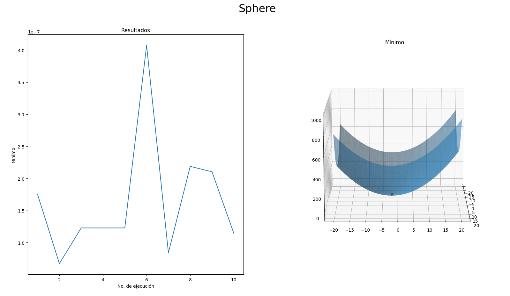
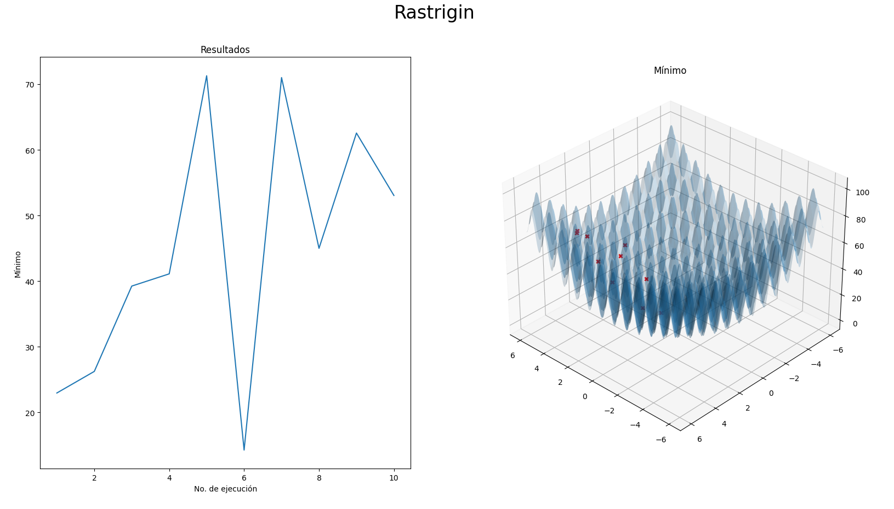

# Práctica 01 - Implementación Gradiente Descendente con Diferencias Finitas
## Reporte de resultados
### Descripción del algoritmo
El algoritmo se implementó en Python3. Las funciones se definen de la siguiente forma:
def sphere(x, y):
	return (x + 2)**2 + (y + 2)**2
def rastrigin(x, y):
	return (10 * 2) + (x**2) + (y**2) - 10 * np.cos(2*np.pi*x) - 10 * np.cos(2*np.pi*y)

Se definen parámetros iniciales y valores iniciales aleatorios:
dx = 0.1
dy = 0.1
h = 0.01
n = 500
x = randint(10)
y = randint(10)

Se calculan diferencias finitas para x y para y de la siguiente forma:
#Diferencias finitas para x
x_p = x + (dx / 2)
x_n = x - (dx / 2)
f_p = (x_p + 2)**2 + (y + 2)**2
f_n = (x_n + 2)**2 + (y + 2)**2
dpx = (f_p - f_n)/dx
#Diferencias finitas para y
y_p = y + (dy / 2)
y_n = y - (dy / 2)
f_p = (x + 2)**2 + (y_p + 2)**2
f_n = (x + 2)**2 + (y_n + 2)**2
dpy = (f_p - f_n)/dy

Con los valores obtenidos de las diferencias finitas se obtiene el gradiente y se actualiza los valores de x y y:
grad = dpx + dpy
x = x - (h * dpx)
y = y - (h * dpy)

Este procedimiento se realiza un número n de veces para aproximar el valor obtenido lo más cercano posible al mínimo, mientras n sea más grande más cercana será la aproximación pero mayor el costo computacional.

### Resultados
El algoritmo se ejecutó 10 veces para cada función, los resultados se presentan en las siguientes gráficas, la gráfica del lado izquierdo muestra el mínimo encontrado en cada una de las ejecuciones, el gráfico en la derecha es la función con un señalamiento de los mínimos encontrados.

La varianza y el valor medio obtenido para cada una de las funciones es:
Varianza resultados esfera:  8.771198380466263e-15
Media de resultados esfera:  1.6459420753514793e-07

Varianza resultados rastrigin:  357.170920941927
Media de resultados rastrigin:  44.66241888525571

En el caso de la esfera podemos observar una varianza prácticamente de cero, lo que indica que en cada ejecución se llegó al mismo resultado. La media también es muy cercana al cero, en este caso se encontró con éxito el mínimo global de la función.
En el caso de rastrigin observamos una varianza muy grande, lo que sugiere que el algoritmo exploró diferentes posibles soluciones encontrando diferentes mínimos locales.

¿Para que se estima el gradiente de una función en este algoritmo?
Para encontrar la dirección del mínimo en cada iteración, si se realizan las iteraciones suficientes se llega a una aproximación aceptable del mínimo de la función.    
¿Por qué tiene un desempeño tan bueno en la función Sphere pero no en Rastrigin?
Por la presencia de múltiples mínimos locales en el caso de rastrigin y un único mínimo global en sphere.
¿Cuál es la complejidad asintótica de este algoritmo (usa O(f(x)) para definir la complejidad de la función objetivo)?
O(n) complejidad constante, la complejidad se mantiene constante sin importar la función objetivo.
